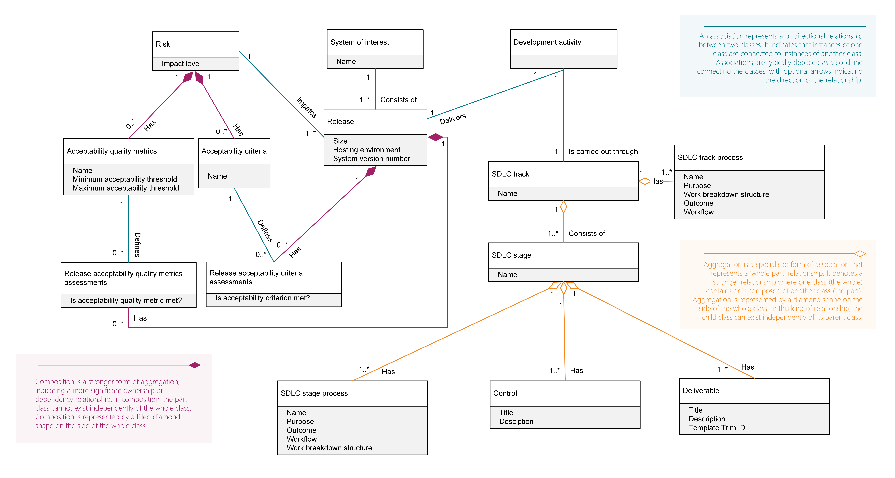

# SDLC Conceptual Reference Model
Throughout the SDLC, a set of concepts have been used based on a conceptual reference model (depicted in Figure 6, which is a class diagram representing entities and their relationships). It is highly recommended to fully understand this model as it will be the foundation behind all the rules and definitions in this handbook.
[Figure 6]

## Overview of the SDLC Entity Relationships
This model shows how various elements of the **Software Development Life Cycle (SDLC)** interact within a structured, governable process. It links **releases, risks, activities, controls, stages**, and **acceptability assessments**, helping ensure each release meets expectations before going live.

### System of Interest & Releases
* A **System of Interest** (e.g., an application or platform) is made up of **one or more Releases**.
* Each **Release** has details like:
  * **Size**
  * **Hosting Environment**
  * **System Version Number**

### Risk and Acceptability
* **Risks** (with impact levels) are linked to **Releases**.
* Each Risk is assessed using:
  * **Acceptability Criteria** (qualitative rules)
  * **Acceptability Quality Metrics** (quantitative thresholds)
* Each release is tested against these using:
  * **Release Acceptability Criteria Assessments** (Did it meet the rule?)
  * **Release Acceptability Quality Metric Assessments** (Did it meet the metric threshold?)

This lets the system answer: *“Is the release good enough to go live?”*

### Development Activities
* A **Development Activity** (e.g., feature development, bug fix) produces a **Release**.
* Each activity follows an **SDLC Track**, which:
  * Has a **name** and contains one or more **Stages**.
  * Tracks are implemented using defined **Track Processes**.

### Stages and Processes
* Each **SDLC Track** consists of multiple **SDLC Stages** (like Planning, Development, Testing, Release).
* Each **Stage** includes:
  * **Controls** (e.g., checkpoints, decisions)
  * **Deliverables** (e.g., documents, code, test results)
  * **Stage Processes**, which define:
    * Name
    * Purpose
    * Workflow
    * Outcome
    * Work Breakdown Structure

## Summary of Key Relationships
| Entity                   | Linked To                           | Purpose                             |
| ------------------------ | ----------------------------------- | ----------------------------------- |
| **System of Interest**   | Releases                            | Grouped versions of the system      |
| **Release**              | Risk, Development Activity          | Tied to work and evaluation         |
| **Risk**                 | Criteria + Metrics                  | Determines what’s “acceptable”      |
| **Development Activity** | SDLC Track                          | Guides how work is structured       |
| **SDLC Track**           | Stages                              | Defines phases of work              |
| **Stage**                | Controls + Deliverables + Processes | Describes what is done at each step |

## Why It Matters
This model ensures that:
* **Every release is traceable** to development work, risks, and acceptance criteria.
* **Governance and quality gates** are built into the process via controls and assessments.
* **SDLC methods are modular**, allowing teams to reuse standard stage structures and deliverables.
