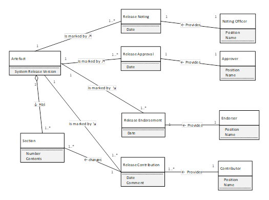
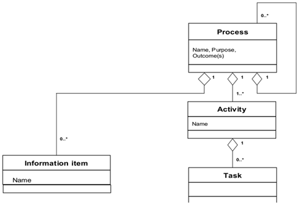
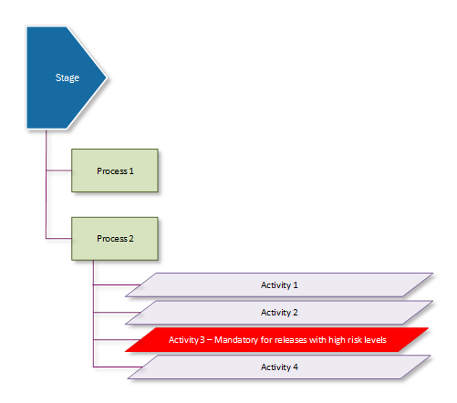

#  Overview

## 1.1    Background

The Department of Education (DET) has been using a systems development life cycle for its internal systems development activities. Recent changes in the landscape and the recommendations made by Deloitte after the OneSchool incident have become the drivers to review and refresh the systems development life cycle of the department to ensure all development activities in DET follow consistent documented processes that comply with industry standards. To address the recommendations, this new systems development life cycle has been developed to be used throughout the department.

## 1.2    Purpose

The purpose of this handbook is to describe a process model with the minimum required stages and considerations for developing and/or implementing systems and software at the Queensland Department of Education and Training.

## 1.3    Limitations

This handbook covers the minimum processes and artefacts related to systems development activities and it could be tailored and adapted to different project sizes and types, however, there are a number of areas for which this handbook will not be prescriptive, as follows:

### 1.3.1      Systems Development Methods

This handbook has been developed with the mindset that the systems development teams will choose their systems development method and to accommodate that, this handbook supports both traditional waterfall and a number of modern agile systems development methods, as explained in “Appendix B – Alignment of Systems Development Method”.  

### 1.3.2     Cloud-Based vs. On-Premises Development

This handbook has been developed to support systems development activities for both cloud-based and on-premises systems, however, the choice between the two is left to be made by the systems development teams and/or project owners through DET’s cloud decision making processes.

## 1.4    Applicability

By definition, a system is a set of man-made components that  may be configured with one or more  of  the  following  system  elements:  hardware,  software,  data,  humans,  processes  (e.g.  processes for providing service to users), procedures (e.g. operator instructions), facilities, materials and naturally occurring entities \[1\]. 

It is envisaged that this handbook and the processes it covers should be applied to all the systems development activities addressing all release scope types, irrespective of the *risk*, *complexity*, *size* and *frequency* involved in the development activity, and/or the hosting environment.

The applicability domain of this process model is not limited to the development of in-house bespoke software only; it should also be used for the development of Integration middleware used to integrate systems and solutions which are developed internally by the agency.

NOTE: Apart from bespoke systems/software and integration middleware, DET release management process specification (TRIM # 16/383893) discusses other categories of releases, including Commercial off the Shelf (COTS) and Content releases.

## 1.5    Conformance to Standards

This handbook endeavours to represent a systems development life cycle model in which all processes are conformant to ISO 15288:2015 (Systems and software engineering - System life cycle processes) \[1\].

It would be worth highlighting that ISO 15288:2015 does not prescribe any particular life cycle models. Instead, it defines a set of processes, termed “life cycle processes”, which can be used in the definition of the system's life cycle. Also, ISO 15288:2015 does not prescribe any  particular  sequence  of  processes  within  the  life  cycle  model \[1\].

Moreover, ISO 15288:2015 has recognized that particular projects or organizations may not need to use all of the processes provided.  Therefore, implementation of this International Standard typically involves selecting and declaring a set of processes suitable to the organization or project. Accordingly, claiming “full conformance to outcomes” asserts that all of the required *outcomes* of the declared set of processes are achieved \[1\], which is what DET’s SDLC process model aims to deliver.

It has been attempted to avoid personal interpretations and paraphrasing and quote contents whenever applicable.

Figure 1 illustrates the processes that have been chosen from ISO 15288:2015 for implementation in DET’s SDLC model.  

## 1.6    Governance, Rigor and Quality

While one of the goals of this handbook is to clarify and define repeatable processes, it also acknowledges and appreciates the fact that the only true measure of progress on a software development project is the regular delivery of “working” software \[2\].

To avoid anti-patterns (e.g. the “more process is better” mindset, documentation inundation etc…), this handbook endeavours to leave the teams with as much flexibility as possible to tailor their activities as long as the outcomes highlighted in this handbook are achieved. Instead of forcing the use of documents, this handbook encourages the use of tools that can help achieve the required outcomes, controls and traceability discussed in this handbook.

Notwithstanding the fact that sign-offs at executive level can promote rigor and support governance, it’s worth highlighting that the 3rd important dimension, “quality”, is mostly achieved at a technical level through reviews and quality assurance protocols the implementation of which can impact resourcing, planning and delivery timing; which in return, will require support and attention from executive and management levels.

## 1.7    Artefact-Level Sign-Offs

In this handbook, it is assumed that there are four levels of interactions with an artefact as follows:

| **Interaction** | **Applicability Scope** |
| :--- | :--- |
| Contribution | Providing and producing contents. This is usually performed at Subject Matter Expert level. |
| Endorsement | Supporting the maturity of the contents and affirming the approval readiness and maturity. This is usually performed at manager level. In cases where application/solution governance boards exist for the application/solution and they own sub-committees, endorsements are performed at such sub-committees to provide assurance for board approvals. |
| Approval | Confirming the maturity of the artefact contents. This is usually performed at director level or if applicable, at application/solution governance board level. |
| Noting | Being informed about the finalization, maturity and approval of an artefact. It is usually performed at an executive level. |

Table 1 - Artefact interactions

There are cases where the risk associated with a release requires extra attention and therefore, endorsements and approvals made by individuals (as opposed to boards) may be shifted one level higher to be performed by directors and executive directors accordingly.

At the discretion of an individual approver, extra peer endorsements may also be acquired in certain circumstances.

It is necessary to version the documents according to the system release versions (please refer to “Release Versioning Conventions” for more details).  For each version, a row should be added to the version history table of the artefacts with the right details in them.

Figure 2 shows a conceptual model for interactions with artefacts. An artefact can have multiple contributions from the same contributor in a single release each with separate comments. For each system/solution release, an artefact can have a unique endorsement and approval from the same endorser and approver accordingly.  

The following tables illustrate examples of how the conceptual model behind artefact interactions can be implemented in the artefacts.

| **System Release Version Number** | **Contributed by** | **Contribution Date** | **Comment** | **Modified Sections** |
| :--- | :--- | :--- | :--- | :--- |
| e.g. 1.2 | | | | |
| e.g. 1.3 | | | | |

Table 2 - Sample table for artefact contribution history log

| **System Release Version Number** | **Endorsed by** | **Endorsement Date** | **Comment** |
| :--- | :--- | :--- | :--- |
| e.g. 1.2 | | | |
| e.g. 1.3 | | | |

Table 3 - - Sample table for artefact endorsement history log

| **System Release Version Number** | **Approved by** | **Approval Date** | **Comment** |
| :--- | :--- | :--- | :--- |
| e.g. 1.2 | | | |
| e.g. 1.3 | | | |

Table 4 - Sample table for artefact approval history log

| **System Release Version Number** | **Noted by** | **Noting Date** | **Comment** |
| :--- | :--- | :--- | :--- |
| e.g. 1.2 | | | |
| e.g. 1.3 | | | |

Table 5 - Sample table for artefact noting history log

## 1.8    Process Description

Throughout this document, all processes have been described based on the guidelines presented in ISO/IEC 24774:2010 \[3\].

Figure 3 illustrates a conceptual model for process description used in this handbook.  

 Figure 3 - Conceptual model for process description [3].

Throughout this handbook, the term “Artefact” or “Deliverable” has been used instead of “Information Item”, as seen in Figure 3.  

 Figure 4 - process inputs, outputs, controls and enabling mechanisms [4]

Throughout this document, a consistent colouring scheme has been used to describe stages, processes and activities as follows:  

 Figure 5 - Stage, process, activity colouring conventions

As will be discussed in “Release Categorization Dimensions (Process Viewpoints”, different category of releases (cloud-based vs on-prem and low risk vs. high risk scenarios), may require different steps and controls.

Activities and steps required for releases with a high level of risk have been highlighted in red for easier access.

## 1.9    Periodic Reviews

It is necessary to periodically review and refresh this handbook and its associated artefacts to ensure it stays relevant and up-to-date. This requires a unit dedicated to support and take ownership of all SDLC-related processes in the organization to ensure for all development activities, a consistent, valid and documented approach is taken.

The processes around the maintenance and management of systems development life cycle (including this handbook and all related artefacts) are all discussed in section 6.2.1 of ISO 15288:2015 \[1\] under “Life cycle model management process” and claiming full conformance to the standard requires the delivery of all outcomes involved in such a process.
